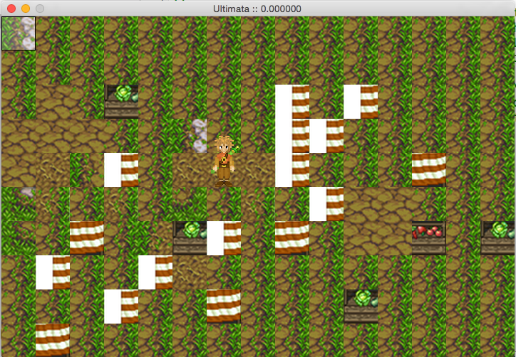

# Ultimata 2

Game programming experiments using SDL 2.0.

## Goal

Ultimata is a project to build a simple two-dimensional role-playing game, drawing great influence from [Tibia](http://www.tibia.com "Tibia MMORPG") and the [Final Fantasy](https://en.wikipedia.org/wiki/Final_Fantasy "Final Fantasy series") series.

# Simple DirectMedia Layer

For more information about SDL, visit http://www.libsdl.org

## Git Diff with Old Mode 100755 / New Mode 100644

The following command was set on this repository to eliminate the files from git status:

```
git config core.filemode false
```

